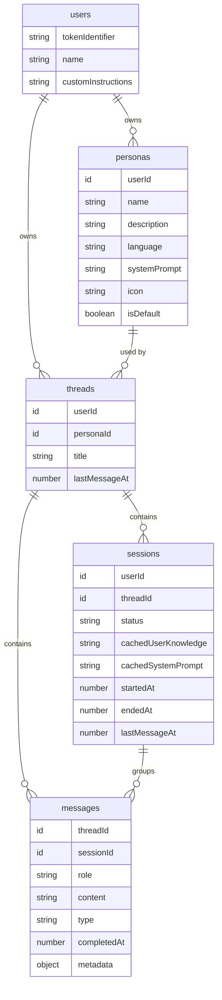
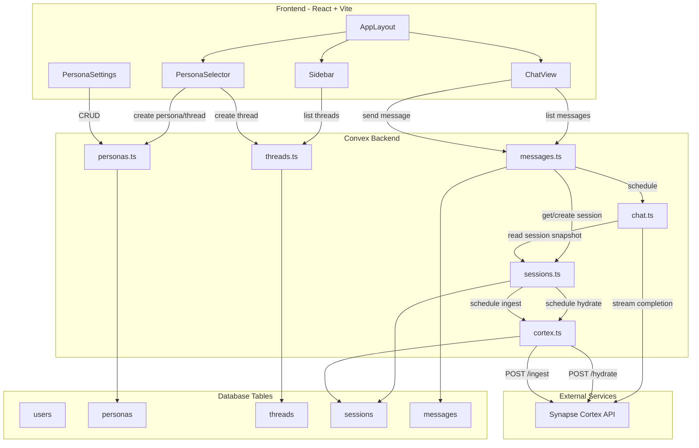
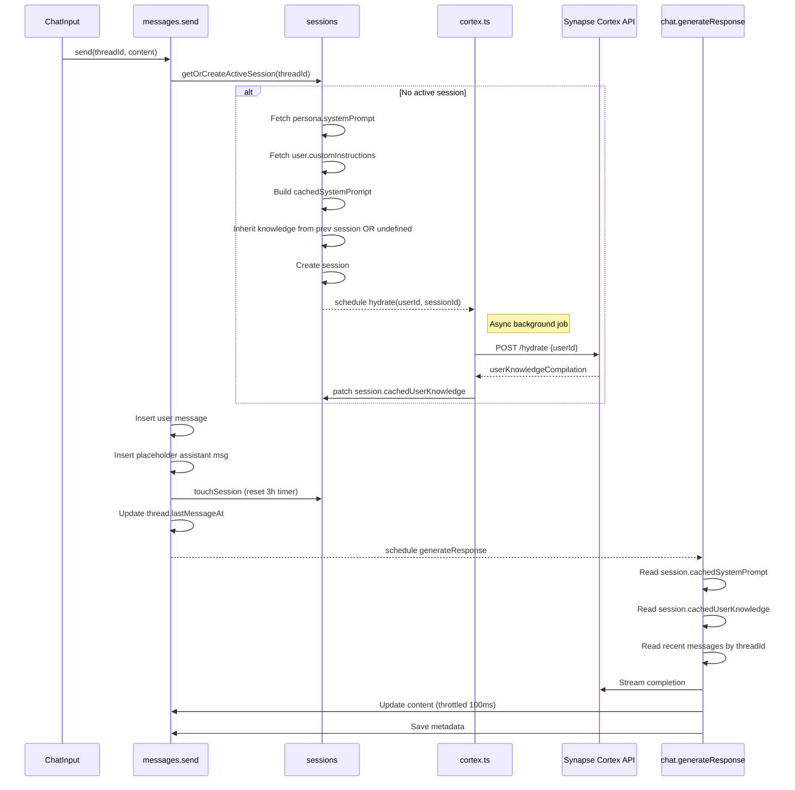
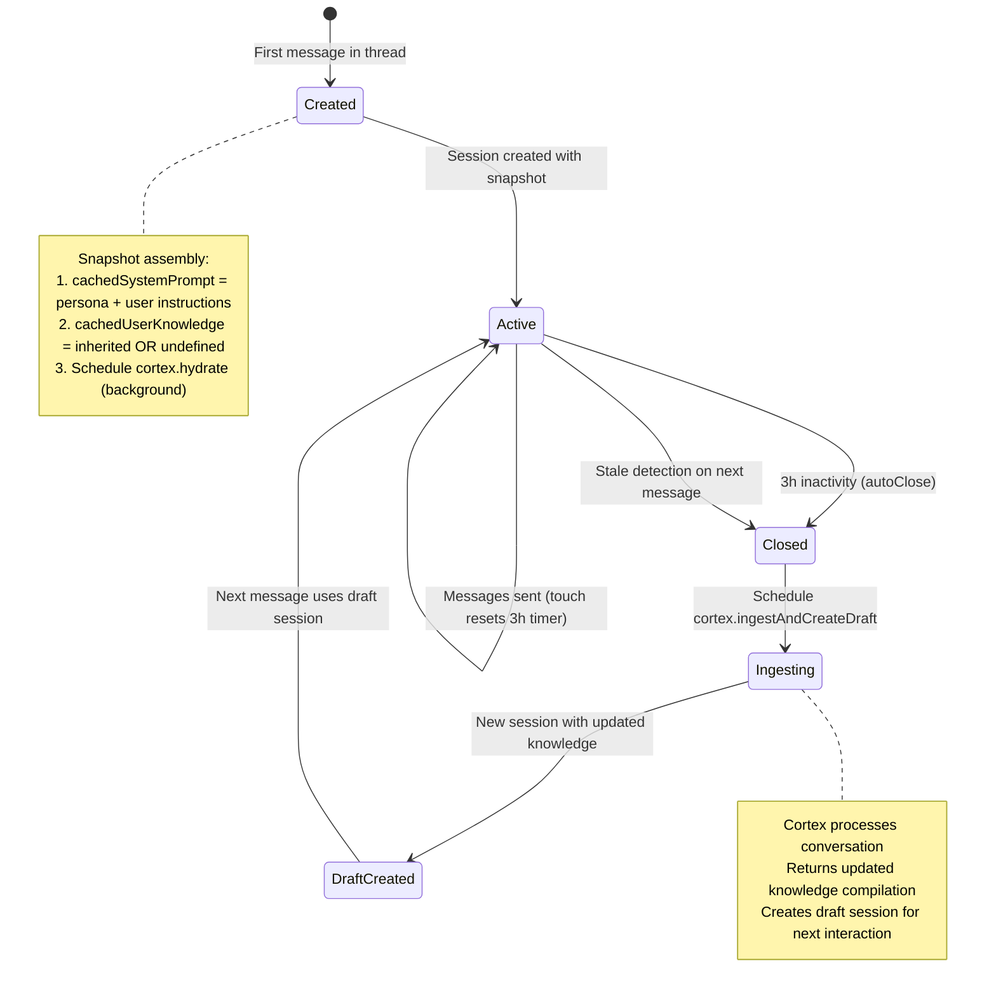

# Synapse AI Chat

A multi-thread, persona-based conversational interface with deep memory. Each conversation is linked to a persona (AI personality) and maintains persistent context through a knowledge graph.

## Tech Stack

- **Frontend:** React 19, TypeScript, Vite, React Router DOM
- **Styling:** TailwindCSS, Shadcn/UI components
- **Backend:** Convex (realtime database + serverless functions)
- **Auth:** Clerk
- **LLM:** Synapse Cortex API (OpenRouter-compatible, uses Gemini 2.5 Flash)
- **Knowledge Graph:** Synapse Cortex (persistent user knowledge compilation via Neo4j)

## Getting Started

### Prerequisites

- Node.js 18+
- npm or pnpm
- Convex account (free tier available)
- Clerk account (free tier available)
- Synapse Cortex API access (or compatible OpenRouter API)

### Setup

1. **Install dependencies:**

   ```bash
   npm install
   ```

2. **Initialize Convex:**

   ```bash
   npx convex dev
   ```

   This will prompt you to create a new Convex project and will generate the `_generated` folder.

3. **Configure environment variables:**

   Create a `.env.local` file based on `.env.local.example`:

   ```bash
   cp .env.local.example .env.local
   ```

   Fill in your values:

   - `VITE_CONVEX_URL` - Your Convex deployment URL (shown after `npx convex dev`)
   - `VITE_CLERK_PUBLISHABLE_KEY` - From Clerk dashboard

4. **Configure Clerk in Convex:**

   In the Convex dashboard, go to Settings > Environment Variables and add:

   - `CLERK_JWT_ISSUER_DOMAIN` - Your Clerk JWT issuer domain (e.g., `https://your-app.clerk.accounts.dev`)
   - `SYNAPSE_CORTEX_API_SECRET` - Your Synapse Cortex API secret key

5. **Start development:**

   ```bash
   # Terminal 1: Convex dev server
   npx convex dev

   # Terminal 2: Vite dev server
   npm run dev
   ```

6. Open [http://localhost:5173](http://localhost:5173)

## Core Concepts

- **Persona:** A configuration template defining AI personality (system prompt + identity + icon + language).
- **Thread:** A conversation channel immutably linked to a specific persona.
- **Session:** An atomic execution unit within a thread that snapshots both the system prompt and user knowledge for consistency.

## Architecture

### Database Schema (ER Diagram)



### System Architecture



### Message Sending Flow



### Session Lifecycle



## Features

### Core Features

- **Multi-Thread Conversations**: Create multiple conversation threads, each with a dedicated persona
- **Persona System**: Choose from templates (Therapist, Coach, Friend) or create custom personas with their own system prompts
- **Deep Memory System**: User knowledge compiled and injected into AI context via Synapse Cortex knowledge graph
- **Real-time Streaming**: AI responses stream in real-time with smooth UI updates (throttled to 100ms intervals)
- **Session Snapshotting**: Sessions freeze both the system prompt and user knowledge for consistency during a conversation
- **Smart Auto-scroll**: Auto-scrolls to bottom on new messages, with scroll-to-bottom button when scrolled up
- **Responsive Design**: Sidebar collapses to hamburger menu on mobile

### Advanced Features

- **Knowledge Hydration**: On session creation, background call to Cortex `/hydrate` fetches latest knowledge (cheap Cypher query, no AI)
- **Knowledge Graph Ingestion**: Closed sessions are automatically ingested into Synapse Cortex to build persistent user knowledge
- **Draft Session Creation**: After ingestion, a draft session is pre-loaded with compiled user knowledge
- **Cross-Session Context**: AI sees full thread history across sessions for better continuity
- **Race Condition Handling**: Handles concurrent session creation during knowledge graph processing
- **Graceful Degradation**: Falls back to previous session knowledge if Cortex ingest fails; sessions work without knowledge

### UI Features

- **Inline Persona Selection**: Full-width card grid for choosing personas (no modal)
- **Persona Settings**: CRUD interface for managing custom personas
- **Session Dividers**: Visual dividers between different sessions in the message list
- **Content Visibility Optimization**: `content-visibility: auto` on message items for rendering performance
- **Thread Sidebar**: Threads sorted by last activity with persona icons and relative timestamps

## Project Structure

```
synapse-ai-chat/
├── convex/                   # Convex backend
│   ├── _generated/           # Auto-generated types
│   ├── schema.ts             # Database schema (5 tables)
│   ├── users.ts              # User management + customInstructions
│   ├── personas.ts           # Persona CRUD + templates
│   ├── threads.ts            # Thread CRUD + cascade delete
│   ├── sessions.ts           # Session management (3h auto-close, dual snapshot)
│   ├── messages.ts           # Message mutations/queries (threadId-scoped)
│   ├── chat.ts               # AI response generation (reads session snapshot)
│   ├── cortex.ts             # Cortex integration (hydrate + ingest)
│   └── auth.config.ts        # Clerk auth config
├── src/
│   ├── components/
│   │   ├── chat/             # Chat components
│   │   │   ├── ChatView.tsx        # Thread chat view (route: /t/:threadId)
│   │   │   ├── ChatInput.tsx       # Message input with threadId
│   │   │   ├── MessageList.tsx     # Messages with content-visibility
│   │   │   ├── MessageItem.tsx     # Individual message rendering
│   │   │   ├── PersonaSelector.tsx # Inline persona selection (route: /)
│   │   │   └── SessionDivider.tsx  # Visual session separator
│   │   ├── layout/
│   │   │   └── AppLayout.tsx       # Sidebar + outlet shell
│   │   ├── settings/
│   │   │   ├── PersonaSettings.tsx # Persona CRUD interface
│   │   │   └── PersonaForm.tsx     # Reusable persona form
│   │   ├── sidebar/
│   │   │   ├── Sidebar.tsx         # Thread list + navigation
│   │   │   └── ThreadItem.tsx      # Memoized thread list item
│   │   └── ui/               # Reusable UI components (shadcn)
│   ├── contexts/
│   │   └── ChatContext.tsx    # Chat state (threadId-scoped messages)
│   ├── lib/
│   │   └── utils.ts          # Utility functions
│   ├── App.tsx               # Routes (/, /t/:threadId, /settings/personas)
│   ├── main.tsx              # Entry point (BrowserRouter + providers)
│   └── index.css             # Global styles + Tailwind
├── public/
└── package.json
```

## Environment Variables

| Variable | Location | Description |
|----------|----------|-------------|
| `VITE_CONVEX_URL` | `.env.local` | Convex deployment URL |
| `VITE_CLERK_PUBLISHABLE_KEY` | `.env.local` | Clerk publishable key |
| `CLERK_JWT_ISSUER_DOMAIN` | Convex dashboard | Clerk JWT issuer domain |
| `SYNAPSE_CORTEX_API_SECRET` | Convex dashboard | Synapse Cortex API secret key |

## Key Implementation Decisions

1. **Routing:** `react-router-dom` with paths `/`, `/t/:threadId`, and `/settings/personas`. Sidebar persists via `AppLayout` with `<Outlet />`.
2. **Auto-close timer: 3 hours** for faster knowledge graph updates.
3. **`cachedUserKnowledge` is optional** -- `undefined` for the first session before any ingestion, handles race conditions gracefully.
4. **Knowledge hydration via `/hydrate` endpoint:** Scheduled as background action on session creation. Cheap Cypher query, no AI processing.
5. **Inline persona selection (no modal):** Content area shows `PersonaSelector` card grid. Selecting one creates the thread and navigates directly.
6. **Context window queries by threadId:** `getRecent` fetches messages across all sessions in the thread for full conversational continuity.
7. **Thread deletion cascade:** Deletes all sessions + messages for the thread in a single mutation.
8. **React best practices:** `content-visibility: auto` for message lists, `useTransition` for form submissions, `React.memo` for thread items, functional setState, passive scroll listeners.

## License

MIT
