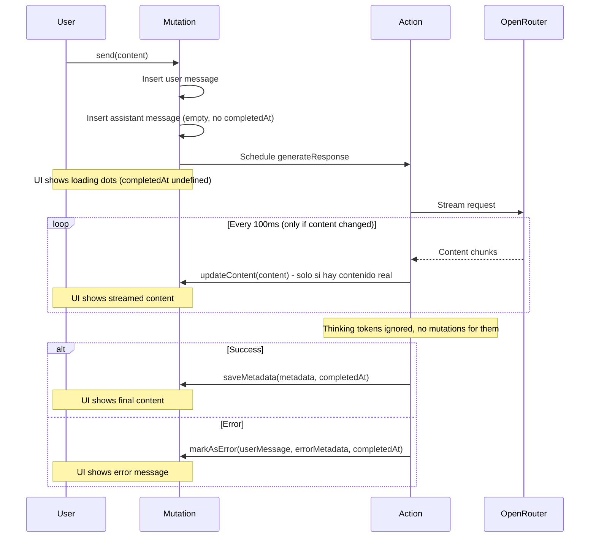

# Synapse AI Chat

A "Deep Memory" conversational interface that maintains a continuous, infinite-thread conversation with persistent context.

## Tech Stack

- **Frontend:** React 19, TypeScript, Vite
- **Styling:** TailwindCSS, Shadcn/UI components
- **Backend:** Convex (realtime database + serverless functions)
- **Auth:** Clerk
- **LLM:** OpenRouter (DeepSeek R1 - free tier)

## Getting Started

### Prerequisites

- Node.js 18+
- npm or pnpm
- Convex account (free tier available)
- Clerk account (free tier available)
- OpenRouter account

### Setup

1. **Install dependencies:**

   ```bash
   npm install
   ```

2. **Initialize Convex:**

   ```bash
   npx convex dev
   ```

   This will prompt you to create a new Convex project and will generate the `_generated` folder.

3. **Configure environment variables:**

   Create a `.env.local` file based on `.env.local.example`:

   ```bash
   cp .env.local.example .env.local
   ```

   Fill in your values:

   - `VITE_CONVEX_URL` - Your Convex deployment URL (shown after `npx convex dev`)
   - `VITE_CLERK_PUBLISHABLE_KEY` - From Clerk dashboard

4. **Configure Clerk in Convex:**

   In the Convex dashboard, go to Settings > Environment Variables and add:

   - `CLERK_JWT_ISSUER_DOMAIN` - Your Clerk JWT issuer domain (e.g., `https://your-app.clerk.accounts.dev`)
   - `OPENROUTER_API_KEY` - Your OpenRouter API key

5. **Start development:**

   ```bash
   # Terminal 1: Convex dev server
   npx convex dev

   # Terminal 2: Vite dev server
   npm run dev
   ```

6. Open [http://localhost:5173](http://localhost:5173)

## Project Structure

```
synapse-ai-chat/
├── convex/                 # Convex backend
│   ├── _generated/         # Auto-generated types
│   ├── schema.ts           # Database schema
│   ├── users.ts            # User management
│   ├── sessions.ts         # Session management
│   ├── messages.ts         # Message mutations/queries
│   ├── chat.ts             # AI response action
│   └── auth.config.ts      # Clerk auth config
├── src/
│   ├── components/
│   │   ├── chat/           # Chat components
│   │   └── ui/             # Reusable UI components
│   ├── lib/
│   │   └── utils.ts        # Utility functions
│   ├── App.tsx
│   ├── main.tsx
│   └── index.css           # Global styles + Tailwind
├── public/
└── package.json
```

## Architecture

### Data Flow

1. User sends message → `sendMessage` mutation
2. Mutation saves user message + creates placeholder assistant message
3. Mutation schedules `generateResponse` action (runs immediately)
4. Action streams response from OpenRouter
5. Action updates assistant message content via internal mutations
6. Frontend subscribes to messages query → real-time updates

### Session Management

- Messages are grouped into "sessions" for context management
- Sessions auto-close after 6 hours of inactivity
- New session is created when user sends first message after timeout
- Session dividers are shown in the UI between different sessions

## Environment Variables

| Variable | Location | Description |
|----------|----------|-------------|
| `VITE_CONVEX_URL` | `.env.local` | Convex deployment URL |
| `VITE_CLERK_PUBLISHABLE_KEY` | `.env.local` | Clerk publishable key |
| `CLERK_JWT_ISSUER_DOMAIN` | Convex dashboard | Clerk JWT issuer domain |
| `OPENROUTER_API_KEY` | Convex dashboard | OpenRouter API key |





## License

MIT
