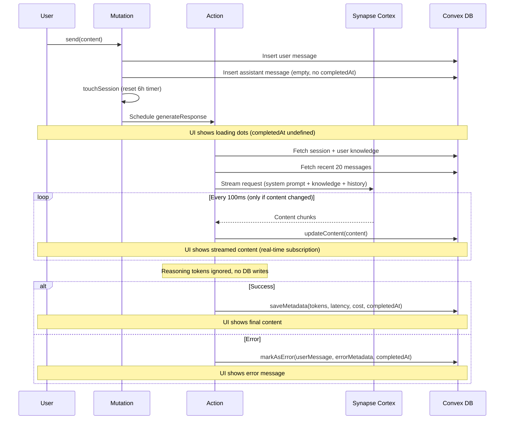
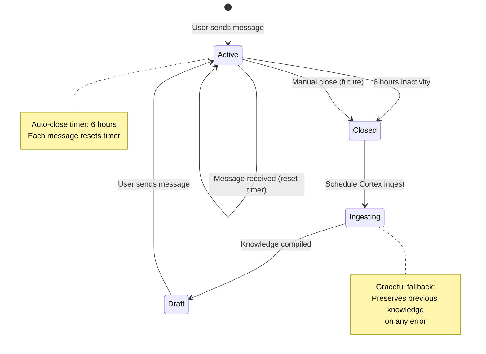

# Synapse AI Chat

A "Deep Memory" conversational interface that maintains a continuous, infinite-thread conversation with persistent context.

## Tech Stack

- **Frontend:** React 19, TypeScript, Vite
- **Styling:** TailwindCSS, Shadcn/UI components
- **Backend:** Convex (realtime database + serverless functions)
- **Auth:** Clerk
- **LLM:** Synapse Cortex API (OpenRouter-compatible, uses Gemini 2.5 Flash)
- **Knowledge Graph:** Synapse Cortex (persistent user knowledge compilation)

## Getting Started

### Prerequisites

- Node.js 18+
- npm or pnpm
- Convex account (free tier available)
- Clerk account (free tier available)
- Synapse Cortex API access (or compatible OpenRouter API)

### Setup

1. **Install dependencies:**

   ```bash
   npm install
   ```

2. **Initialize Convex:**

   ```bash
   npx convex dev
   ```

   This will prompt you to create a new Convex project and will generate the `_generated` folder.

3. **Configure environment variables:**

   Create a `.env.local` file based on `.env.local.example`:

   ```bash
   cp .env.local.example .env.local
   ```

   Fill in your values:

   - `VITE_CONVEX_URL` - Your Convex deployment URL (shown after `npx convex dev`)
   - `VITE_CLERK_PUBLISHABLE_KEY` - From Clerk dashboard

4. **Configure Clerk in Convex:**

   In the Convex dashboard, go to Settings > Environment Variables and add:

   - `CLERK_JWT_ISSUER_DOMAIN` - Your Clerk JWT issuer domain (e.g., `https://your-app.clerk.accounts.dev`)
   - `OPENROUTER_API_KEY` - Your OpenRouter API key

5. **Start development:**

   ```bash
   # Terminal 1: Convex dev server
   npx convex dev

   # Terminal 2: Vite dev server
   npm run dev
   ```

6. Open [http://localhost:5173](http://localhost:5173)

## Features

### Core Features

- **Infinite Thread Conversation**: Continuous, seamless conversation experience across sessions with persistent context
- **Deep Memory System**: User knowledge is compiled and injected into AI context via Synapse Cortex knowledge graph
- **Real-time Streaming**: AI responses stream in real-time with smooth UI updates (throttled to 100ms intervals)
- **Session Management**: Automatic session rotation after 6 hours of inactivity with knowledge graph integration
- **Smart Auto-scroll**: Auto-scrolls to bottom on new messages, with scroll-to-bottom button when scrolled up
- **Error Handling**: Graceful error handling with user-friendly messages and detailed error logging
- **Analytics Tracking**: Token usage, latency, and cost tracking for each AI response
- **Markdown Support**: Rich markdown rendering for AI responses with security hardening
- **Responsive Design**: Modern, mobile-friendly UI built with TailwindCSS and Shadcn/UI

### Advanced Features

- **Knowledge Graph Integration**: Closed sessions are automatically ingested into Synapse Cortex to build persistent user knowledge
- **Draft Session Creation**: After session ingestion, a draft session is pre-loaded with compiled user knowledge
- **Context Window Management**: Recent 20 messages included in AI context, with user knowledge prepended to system prompt
- **Streaming Optimization**: Throttled database updates during streaming to reduce write overhead
- **Race Condition Handling**: Handles concurrent session creation during knowledge graph processing
- **Graceful Degradation**: Falls back to previous session knowledge if Cortex ingest fails

## Application Flow

### User Authentication Flow

1. User authenticates via Clerk
2. On first login, user record is automatically created in Convex database
3. User profile (name) is derived from Clerk identity (name → email → "Anonymous")

### Message Sending Flow

1. **User Input**:
   - User types message in `ChatInput` component
   - Auto-resizing textarea (max 200px height)
   - Enter to send, Shift+Enter for new line

2. **Message Creation** (`messages.send` mutation):
   - Validates content (max 10,000 characters)
   - Gets or creates user record
   - Gets or creates active session (handles stale session rotation)
   - Inserts user message into database
   - Creates placeholder assistant message (empty content, no `completedAt`)
   - Touches session (resets 6-hour auto-close timer)
   - Schedules `generateResponse` action (runs immediately)

3. **AI Response Generation** (`chat.generateResponse` action):
   - Fetches session data and cached user knowledge
   - Retrieves recent 20 messages for context
   - Builds API payload with:
     - System prompt + user knowledge compilation
     - Conversation history (filtered to exclude current placeholder)
   - Streams response from Synapse Cortex API (OpenRouter-compatible)
   - Updates message content every 100ms during streaming (only if content changed)
   - Ignores reasoning/thinking tokens (not displayed to users)
   - On completion: saves metadata (tokens, latency, cost, finish reason)
   - On error: marks message as error type with user-friendly message

4. **Real-time UI Updates**:
   - Frontend subscribes to `messages.list` query
   - UI automatically updates as message content streams
   - Loading indicator shown when `completedAt` is undefined
   - Streaming animation during active content updates
   - Auto-scrolls to bottom (unless user has scrolled up)

### Session Lifecycle Flow

1. **Active Session**:
   - Created when user sends first message or returns after session timeout
   - Status: `active`
   - Contains `cachedUserKnowledge` (compiled from previous sessions)
   - Auto-close timer scheduled for 6 hours after last message

2. **Session Activity**:
   - Each message resets the 6-hour timer (debounced auto-close)
   - Previous scheduled job is cancelled, new one created
   - `lastMessageAt` timestamp updated

3. **Session Auto-Close**:
   - Triggered after 6 hours of inactivity
   - Status changed to `closed`
   - `endedAt` timestamp set
   - Auto-close job cancelled
   - Cortex ingest scheduled immediately

4. **Knowledge Graph Ingestion** (`cortex.ingestAndCreateDraft`):
   - Fetches all messages from closed session
   - POSTs to Synapse Cortex `/ingest` endpoint
   - Sends session metadata and message history
   - Receives compiled user knowledge compilation
   - Creates draft session with new knowledge (or updates existing if user already chatting)
   - Graceful fallback: preserves previous knowledge on any error

5. **Draft Session**:
   - Pre-loaded with compiled user knowledge
   - Ready for user's next message
   - No auto-close timer until first message sent

### Stale Session Handling

- When user returns after 6+ hours:
  - Existing active session is detected as stale
  - Session is immediately closed
  - New session created with default or inherited knowledge
  - User can continue conversation seamlessly

### Frontend Components Flow

1. **ChatLayout**: Main container with header and chat area
2. **ChatProvider**: Context provider that subscribes to messages query
3. **MessageList**: 
   - Displays all messages across sessions
   - Shows session dividers between different sessions
   - Auto-scrolls on new messages
   - Scroll-to-bottom button when scrolled up
   - Loading and empty states
4. **MessageItem**: 
   - Renders individual messages
   - User messages: plain text
   - Assistant messages: markdown with security hardening
   - Streaming indicators and error states
   - Timestamps on hover
5. **ChatInput**: 
   - Message input with auto-resize
   - Submit handling and validation
   - Disabled during generation

## Project Structure

```
synapse-ai-chat/
├── convex/                 # Convex backend
│   ├── _generated/         # Auto-generated types
│   ├── schema.ts           # Database schema
│   ├── users.ts            # User management
│   ├── sessions.ts         # Session management
│   ├── messages.ts         # Message mutations/queries
│   ├── chat.ts             # AI response action
│   └── auth.config.ts      # Clerk auth config
├── src/
│   ├── components/
│   │   ├── chat/           # Chat components
│   │   └── ui/             # Reusable UI components
│   ├── lib/
│   │   └── utils.ts        # Utility functions
│   ├── App.tsx
│   ├── main.tsx
│   └── index.css           # Global styles + Tailwind
├── public/
└── package.json
```

## Architecture

### System Overview

The application follows a real-time, event-driven architecture:

- **Frontend**: React components with Convex real-time subscriptions
- **Backend**: Convex mutations (synchronous) and actions (asynchronous, Node.js)
- **AI Integration**: Synapse Cortex API for LLM responses and knowledge graph
- **Data Flow**: Mutations → Actions → Internal Mutations → Real-time Queries

### Data Flow

1. User sends message → `messages.send` mutation
2. Mutation saves user message + creates placeholder assistant message
3. Mutation schedules `chat.generateResponse` action (runs immediately)
4. Action streams response from Synapse Cortex API
5. Action updates assistant message content via internal mutations (throttled to 100ms)
6. Frontend subscribes to `messages.list` query → real-time updates
7. On session close → Cortex ingest → draft session creation with compiled knowledge

### Session Management

- Messages are grouped into "sessions" for context management
- Sessions auto-close after 6 hours of inactivity (debounced timer)
- Closed sessions trigger knowledge graph ingestion via Synapse Cortex
- New sessions inherit compiled user knowledge from previous sessions
- Session dividers are shown in the UI between different sessions
- Stale sessions are automatically rotated when user returns after timeout

## Environment Variables

| Variable | Location | Description |
|----------|----------|-------------|
| `VITE_CONVEX_URL` | `.env.local` | Convex deployment URL |
| `VITE_CLERK_PUBLISHABLE_KEY` | `.env.local` | Clerk publishable key |
| `CLERK_JWT_ISSUER_DOMAIN` | Convex dashboard | Clerk JWT issuer domain |
| `SYNAPSE_CORTEX_API_SECRET` | Convex dashboard | Synapse Cortex API secret key |




### Session Lifecycle Diagram




## License

MIT
