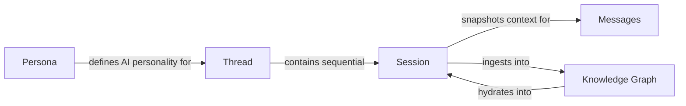
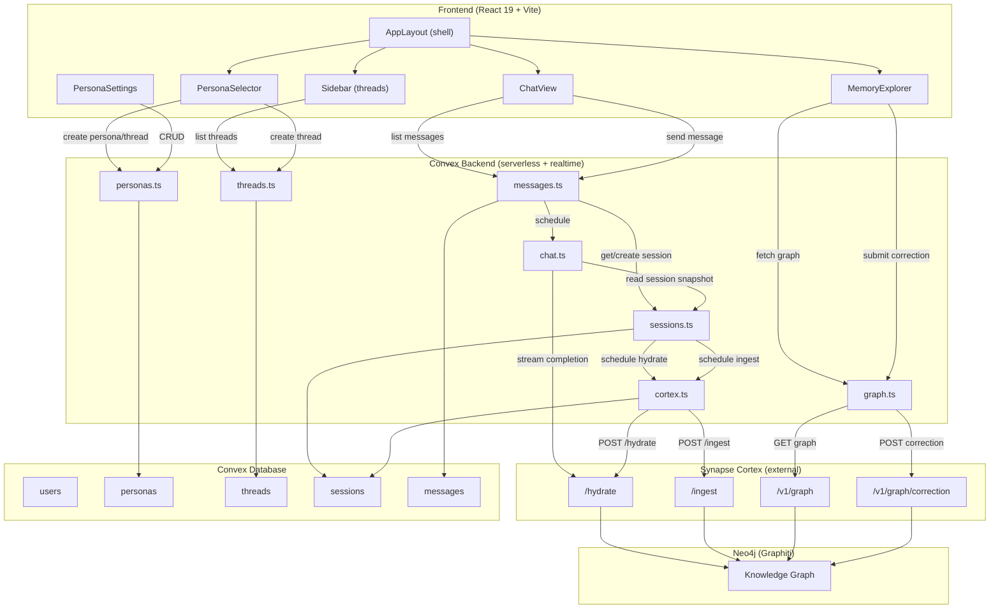
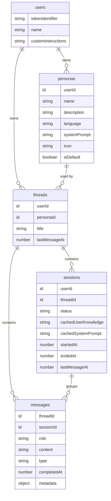
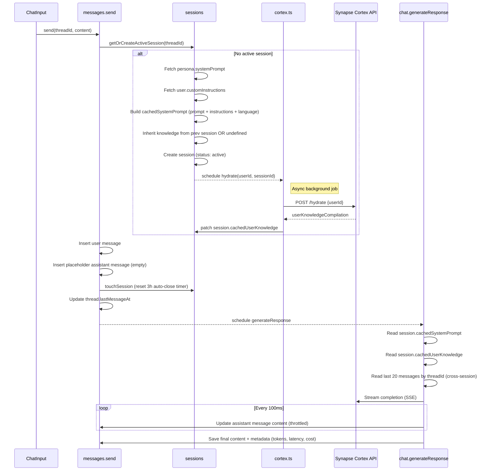
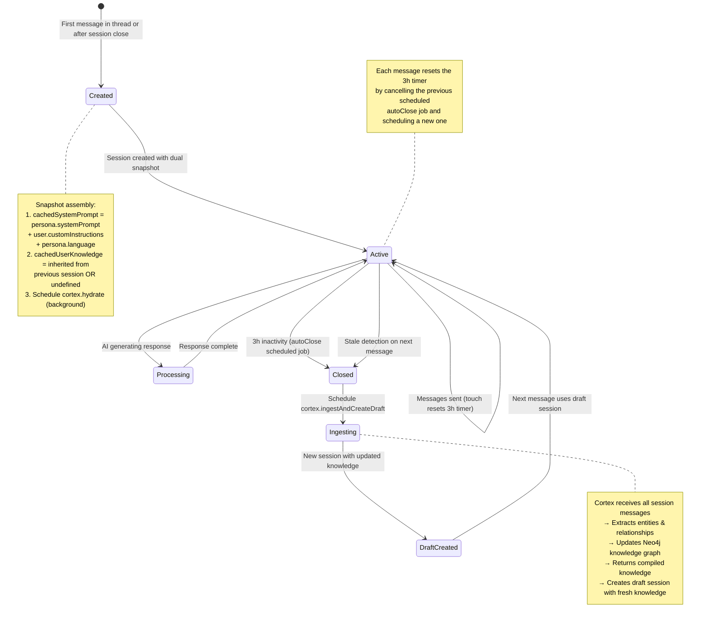
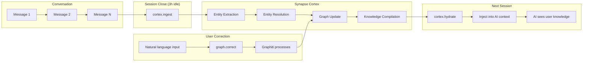

# Synapse AI Chat

A multi-thread, persona-based conversational interface with **deep memory**. Each conversation is linked to a persona (AI personality) and maintains persistent context through a knowledge graph powered by [Graphiti](https://github.com/getzep/graphiti) / Neo4j. Users can visualize, inspect, and correct their knowledge graph in real time.

---

## Table of Contents

- [Overview](#overview)
- [Core Concepts](#core-concepts)
- [Architecture](#architecture)
  - [High-Level System Architecture](#high-level-system-architecture)
  - [Database Schema](#database-schema)
  - [Message Sending Flow](#message-sending-flow)
  - [Session Lifecycle](#session-lifecycle)
  - [Knowledge Graph Pipeline](#knowledge-graph-pipeline)
- [Features](#features)
  - [Conversational AI](#conversational-ai)
  - [Knowledge Graph & Deep Memory](#knowledge-graph--deep-memory)
  - [Memory Explorer](#memory-explorer)
  - [Persona System](#persona-system)
  - [UI & UX](#ui--ux)
- [Technical Highlights](#technical-highlights)
- [Project Structure](#project-structure)
- [Tech Stack](#tech-stack)
- [Getting Started](#getting-started)
- [Environment Variables](#environment-variables)
- [Key Implementation Decisions](#key-implementation-decisions)
- [License](#license)

---

## Overview

Synapse AI Chat goes beyond a typical chatbot, it builds and maintains a **persistent knowledge graph** about each user across every conversation. The system automatically ingests conversations into a Neo4j-backed knowledge graph via Synapse Cortex, compiles that knowledge, and injects it into future AI interactions. This gives the AI a continuously evolving understanding of the user, enabling deeply personalized conversations that improve over time.

Users can also **visualize, explore, and correct** their knowledge graph through an interactive force-directed graph, inspect individual entities and relationships, and submit natural language corrections that propagate through the graph.

---

## Core Concepts




| Concept             | Description                                                                                                                                                                                                                                                  |
| ------------------- | ------------------------------------------------------------------------------------------------------------------------------------------------------------------------------------------------------------------------------------------------------------ |
| **Persona**         | A configuration template defining AI personality: system prompt, identity, icon, and language preference. Users create custom personas or use templates (Therapist, Coach, Friend).                                                                          |
| **Thread**          | A conversation channel immutably linked to a specific persona. All messages within a thread share the same AI personality.                                                                                                                                   |
| **Session**         | An atomic execution unit within a thread. Sessions **snapshot** both the system prompt and user knowledge at creation time, ensuring consistency even if the persona or knowledge changes mid-conversation. Sessions auto-close after 3 hours of inactivity. |
| **Knowledge Graph** | A Neo4j-backed graph (via Synapse Cortex / Graphiti) that stores compiled knowledge about the user -- facts, relationships, preferences -- extracted from conversations and refined over time.                                                               |


---

## Architecture

### High-Level System Architecture



**Data flow summary:**

1. **Frontend** communicates with Convex via reactive queries and mutations (real-time subscriptions).
2. **Convex backend** orchestrates session management, message persistence, and AI generation.
3. **Synapse Cortex** serves as the bridge to the Neo4j knowledge graph -- handling hydration (reads), ingestion (writes), graph queries, and NLP-based corrections.
4. **Neo4j / Graphiti** stores the actual knowledge graph, processing entity extraction and relationship management.

---

### Database Schema



Key points:

- **Sessions** store `cachedSystemPrompt` and `cachedUserKnowledge` as snapshots -- decoupling the running conversation from live persona/knowledge changes.
- **Messages** store analytics in `metadata`: token counts, latency, cost, finish reason, and error details.
- Sessions use a status state machine: `active` → `processing` → `active` | `closed`.

---

### Message Sending Flow



**Key details:**

- Messages are fetched by `threadId` (not `sessionId`), giving the AI full cross-session conversational continuity.
- Streaming updates are throttled to 100ms intervals to balance responsiveness with database write efficiency.
- The placeholder assistant message is created immediately, giving the UI a target to render streaming content into.

---

### Session Lifecycle



**Why sessions matter:**

- **Snapshot isolation**: Sessions freeze the system prompt and knowledge, so changes to the persona or new knowledge don't affect an ongoing conversation mid-flow.
- **Knowledge evolution**: When a session closes, its messages are ingested into the knowledge graph. The next session starts with updated knowledge.
- **Race condition handling**: If a user sends a message while ingestion is creating a draft session, the system detects the existing active session and updates it instead of creating a duplicate.

---

### Knowledge Graph Pipeline



**Pipeline stages:**

1. **Conversation**: User interacts with AI within a session. Messages accumulate.
2. **Ingestion** (on session close): All session messages are sent to Cortex `/ingest`. Cortex processes them through Graphiti -- extracting entities, resolving duplicates, and updating the Neo4j graph.
3. **Hydration** (on session creation): A cheap Cypher query fetches the compiled knowledge and injects it into the new session's cached context. No AI processing needed.
4. **Correction** (user-initiated): Users can submit natural language corrections (e.g., *"I no longer live in Colombia, I moved to Canada"*) that Graphiti processes to invalidate outdated edges and create new ones.

**Graceful degradation:**

- If hydration fails → session continues without knowledge (works fine, just less personalized).
- If ingestion fails → previous session's knowledge is preserved for the draft session.
- If graph fetch fails → Memory Explorer shows empty graph with no errors.

---

## Features

### Conversational AI

- **Multi-Thread Conversations**: Create multiple threads, each with a dedicated persona and independent history.
- **Real-time Streaming**: AI responses stream via SSE with throttled DB updates (100ms), enabling smooth, character-by-character rendering.
- **Cross-Session Context**: The AI sees the last 20 messages across all sessions in the thread for full conversational continuity.
- **Session Snapshotting**: Dual snapshot (system prompt + knowledge) ensures consistency within a session.
- **Smart Auto-scroll**: Auto-scrolls to bottom on new messages, with scroll-to-bottom button when scrolled up.
- **Markdown Rendering**: Rich markdown support with streaming animation via Streamdown.
- **Error Categorization**: Structured error types (CONFIG_ERROR, API_ERROR, PROVIDER_ERROR) with user-friendly messages and technical details in metadata.
- **Analytics Tracking**: Per-message token counts, latency, cost, and finish reason stored in metadata.

### Knowledge Graph & Deep Memory

- **Automatic Knowledge Extraction**: Closed sessions are automatically ingested into the knowledge graph, extracting entities and relationships from conversations.
- **Knowledge Hydration**: On session creation, a background job fetches the latest compiled knowledge via a cheap Cypher query (no AI processing).
- **Knowledge Compilation**: Cortex compiles raw graph data into a structured text summary injected into the AI's context window.
- **Draft Session Pre-loading**: After ingestion, a draft session is pre-created with the latest knowledge, ready for the next interaction.
- **Knowledge Inheritance**: New sessions inherit knowledge from the previous session while hydration completes in the background.
- **Race Condition Handling**: Concurrent session creation during knowledge processing is detected and handled gracefully.
- **Graceful Degradation**: Every stage fails safely -- sessions work without knowledge, ingestion failures preserve previous knowledge.

### Memory Explorer

- **Interactive Graph Visualization**: Force-directed graph (via `react-force-graph-2d`) renders entities as nodes and relationships as edges.
- **Node Inspection**: Click any entity to see its name, summary, connection count, and all incoming/outgoing relationships with fact labels.
- **Entity Search**: Searchable, filterable entity list sorted by connection count, with click-to-center navigation.
- **Natural Language Corrections**: Submit corrections like *"I no longer work at Google, I joined Meta"* -- Graphiti processes them to invalidate outdated edges and create new relationships.
- **Real-time Refresh**: Graph auto-refreshes after corrections. Manual refresh available.
- **Responsive Layout**: Desktop shows entity list + graph + inspector side by side. Mobile uses full-width graph with bottom-sheet inspector.
- **Custom Rendering**: Nodes sized by connection count, selection highlighting with glow effects, labels appear on zoom.

### Persona System

- **Template Personas**: Pre-built personalities (Therapist, Coach, Friend) with tailored system prompts.
- **Custom Personas**: Full CRUD for creating personas with custom name, description, system prompt, icon (emoji), and language preference.
- **Language Enforcement**: Per-persona language preference is compiled into the system prompt.
- **Custom Instructions**: Global user instructions applied across all personas.
- **Inline Selection**: Full-width card grid for choosing personas (no modal), directly creates thread and navigates.

---

## Technical Highlights


| Area                      | Detail                                                                                                  |
| ------------------------- | ------------------------------------------------------------------------------------------------------- |
| **Realtime**              | Convex reactive queries auto-update UI when DB changes -- no polling, no WebSocket management           |
| **Streaming**             | SSE streaming with 100ms throttled writes to Convex; frontend derives `isGenerating` from message state |
| **Session snapshot**      | Dual snapshot (system prompt + knowledge) decouples running conversation from live changes              |
| **Knowledge pipeline**    | Async hydrate on create → conversation → ingest on close → draft with fresh knowledge                   |
| **Auto-close timer**      | 3h debounced via Convex scheduled functions; each message cancels previous and reschedules              |
| **Cross-session context** | Messages queried by `threadId` (not `sessionId`) for full thread continuity                             |
| **Graph visualization**   | `react-force-graph-2d` with d3-force physics, custom rendering, imperative camera API                   |
| **NLP corrections**       | Natural language graph corrections via Graphiti entity resolution                                       |
| **Error handling**        | Categorized errors (CONFIG, API, PROVIDER, PARSE, UNKNOWN) with user-friendly + technical messages      |
| **Performance**           | `content-visibility: auto`, `React.memo`, passive listeners, throttled updates, efficient DB indexes    |
| **Auth**                  | Clerk JWT verification on every Convex mutation/query; identity-scoped data access                      |
| **Cascade deletes**       | Thread deletion removes all sessions + messages in a single mutation                                    |


---

## Project Structure

```
synapse-ai-chat/
├── convex/                       # Convex backend (serverless functions + database)
│   ├── schema.ts                 # Database schema (5 tables, indexed)
│   ├── users.ts                  # User management + customInstructions
│   ├── personas.ts               # Persona CRUD + default templates
│   ├── threads.ts                # Thread CRUD + cascade delete
│   ├── sessions.ts               # Session lifecycle (3h auto-close, dual snapshot, state machine)
│   ├── messages.ts               # Message mutations/queries (streaming support, analytics)
│   ├── chat.ts                   # AI response generation (SSE streaming, throttled writes)
│   ├── cortex.ts                 # Cortex integration (hydrate + ingest + draft creation)
│   ├── graph.ts                  # Knowledge graph queries + NLP corrections
│   └── auth.config.ts            # Clerk auth configuration
├── src/
│   ├── components/
│   │   ├── chat/                 # Chat components
│   │   │   ├── ChatView.tsx           # Thread chat view (route: /t/:threadId)
│   │   │   ├── ChatInput.tsx          # Message input with threadId
│   │   │   ├── MessageList.tsx        # Messages with content-visibility + auto-scroll
│   │   │   ├── MessageItem.tsx        # Individual message rendering (streaming detection)
│   │   │   ├── PersonaSelector.tsx    # Inline persona selection (route: /)
│   │   │   └── SessionDivider.tsx     # Visual session separator
│   │   ├── memory/               # Knowledge graph visualization
│   │   │   ├── MemoryExplorer.tsx     # Main memory view (route: /memory)
│   │   │   ├── GraphCanvas.tsx        # Force-directed graph (react-force-graph-2d)
│   │   │   ├── EntityList.tsx         # Searchable entity list
│   │   │   ├── NodeInspector.tsx      # Entity detail + relationships
│   │   │   ├── MemoryCorrection.tsx   # NLP correction input
│   │   │   └── types.ts              # Graph data types
│   │   ├── layout/
│   │   │   └── AppLayout.tsx          # Sidebar + outlet shell (responsive)
│   │   ├── settings/
│   │   │   ├── PersonaSettings.tsx    # Persona CRUD interface
│   │   │   ├── PersonaForm.tsx        # Reusable persona form
│   │   │   └── EmojiPicker.tsx        # Emoji picker for persona icons
│   │   ├── sidebar/
│   │   │   ├── Sidebar.tsx            # Thread list + navigation
│   │   │   └── ThreadItem.tsx         # Memoized thread list item
│   │   └── ui/                   # Reusable UI primitives (shadcn)
│   ├── contexts/
│   │   ├── ChatContext.tsx        # Chat state provider (thread-scoped messages)
│   │   └── useChatContext.ts      # Chat context hook
│   ├── lib/
│   │   ├── utils.ts               # Utility functions
│   │   └── markdown-security.ts   # Markdown sanitization
│   ├── App.tsx                    # Routes (/, /t/:threadId, /settings/personas, /memory)
│   ├── main.tsx                   # Entry point (BrowserRouter + providers)
│   └── index.css                  # Global styles + Tailwind
└── package.json
```

---

## Tech Stack


| Layer                   | Technology                                                         |
| ----------------------- | ------------------------------------------------------------------ |
| **Frontend**            | React 19, TypeScript, Vite, React Router DOM                       |
| **Styling**             | TailwindCSS, Shadcn/UI components                                  |
| **Backend**             | Convex (realtime database + serverless functions + scheduled jobs) |
| **Auth**                | Clerk (JWT-based, verified on every backend call)                  |
| **LLM**                 | Synapse Cortex API (OpenRouter-compatible, uses Gemini 2.5 Flash)  |
| **Knowledge Graph**     | Synapse Cortex → Graphiti → Neo4j                                  |
| **Graph Visualization** | react-force-graph-2d (d3-force)                                    |
| **Markdown**            | Streamdown (streaming-aware markdown rendering)                    |


---

## Getting Started

### Prerequisites

- Node.js 18+
- npm or pnpm
- Convex account ([free tier available](https://www.convex.dev/))
- Clerk account ([free tier available](https://clerk.com/))
- Synapse Cortex API access (or compatible OpenRouter API)

### Setup

1. **Install dependencies:**
  ```bash
   npm install
  ```
2. **Initialize Convex:**
  ```bash
   npx convex dev
  ```
   This will prompt you to create a new Convex project and will generate the `_generated` folder.
3. **Configure environment variables:**
  Create a `.env.local` file based on `.env.local.example`:
   Fill in your values (see [Environment Variables](#environment-variables) below).
4. **Configure Clerk in Convex:**
  In the Convex dashboard, go to Settings > Environment Variables and add the server-side variables.
5. **Start development:**
  ```bash
   # Terminal 1: Convex dev server (watches for schema/function changes)
   npx convex dev

   # Terminal 2: Vite dev server
   npm run dev
  ```
6. Open [http://localhost:5173](http://localhost:5173)

---

## Environment Variables


| Variable                     | Location         | Description                                                           |
| ---------------------------- | ---------------- | --------------------------------------------------------------------- |
| `VITE_CONVEX_URL`            | `.env.local`     | Convex deployment URL (shown after `npx convex dev`)                  |
| `VITE_CLERK_PUBLISHABLE_KEY` | `.env.local`     | Clerk publishable key (from Clerk dashboard)                          |
| `CLERK_JWT_ISSUER_DOMAIN`    | Convex dashboard | Clerk JWT issuer domain (e.g., `https://your-app.clerk.accounts.dev`) |
| `SYNAPSE_CORTEX_API_SECRET`  | Convex dashboard | Synapse Cortex API secret key                                         |


---

## Key Implementation Decisions

1. **Session auto-close timer: 3 hours** — balances conversational coherence with knowledge graph freshness. Shorter timers mean more frequent ingestion.
2. `**cachedUserKnowledge` is optional** — `undefined` for the first session before any ingestion; handles race conditions where hydration hasn't completed yet.
3. **Knowledge hydration via `/hydrate**` — scheduled as a background action on session creation. Cheap Cypher query, no AI processing, so it's fast and low-cost.
4. **Cross-session message queries** — `getRecent` fetches the last 20 messages by `threadId` across all sessions for full thread continuity.
5. **Inline persona selection (no modal)** — content area shows `PersonaSelector` card grid. Selecting one creates the thread and navigates directly.
6. **Thread deletion cascade** — deletes all sessions + messages for the thread in a single mutation.
7. **NLP-based memory corrections** — instead of manual entity editing, users submit natural language corrections that Graphiti processes through its entity resolution pipeline.
8. **Routing:** `react-router-dom` with paths `/`, `/t/:threadId`, `/settings/personas`, and `/memory`. Sidebar persists via `AppLayout` with `<Outlet />`.
9. **React performance patterns:** `content-visibility: auto` for message lists, `useTransition` for form submissions, `React.memo` for thread items, functional setState, passive scroll listeners.
10. **Full-context injection over RAG** — see rationale below.

### Why Full-Context Injection Instead of RAG

A common approach for knowledge-augmented LLMs is Retrieval-Augmented Generation (RAG), where the system retrieves relevant chunks per query and injects only those into the prompt. Synapse AI Chat intentionally takes a different approach: **the entire compiled user knowledge is injected into the system prompt on every request**. Here's why:

1. **Better connection-building by the LLM.** Although Graphiti supports semantic search over the graph to retrieve context per query, giving the LLM the full knowledge picture produces higher-quality responses. The model doesn't have to "ask" for specific data it can see the full landscape of what it knows about the user and draw connections between seemingly unrelated facts on its own. This leads to more insightful, contextually rich answers.
2. **Curated, condensed knowledge keeps context small.** Gemini models offer large context windows, but we don't blindly dump everything in. Graphiti's graph maintenance does the heavy lifting: invalidated nodes are pruned, disconnected nodes are ignored, and the compilation is a condensed summary, not raw conversation logs. Combined with scoping message history to the last 20 messages, the full context stays relevant and compact despite containing all user knowledge.
3. **Reduced agent complexity and faster response times.** RAG requires tool-calling patterns (search → retrieve → inject → generate), adding latency and architectural complexity. By pre-loading knowledge into the session snapshot, the AI generates responses in a single pass with no intermediate retrieval steps. This results in faster time-to-first-token and a simpler, more predictable execution flow.
4. **Future: hybrid strategy for very large knowledge graphs.** As a user's knowledge graph scales significantly, a hybrid approach can be introduced: raise the relevance threshold for what gets included in the base compilation (system prompt), and add a retrieval fallback for when the model needs specifics about a topic not covered in the base context. This keeps the default path fast while handling edge cases.

---

## License

MIT