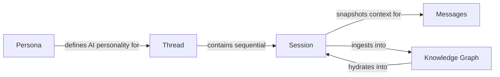
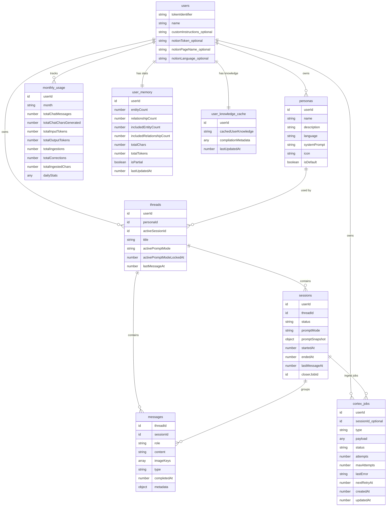
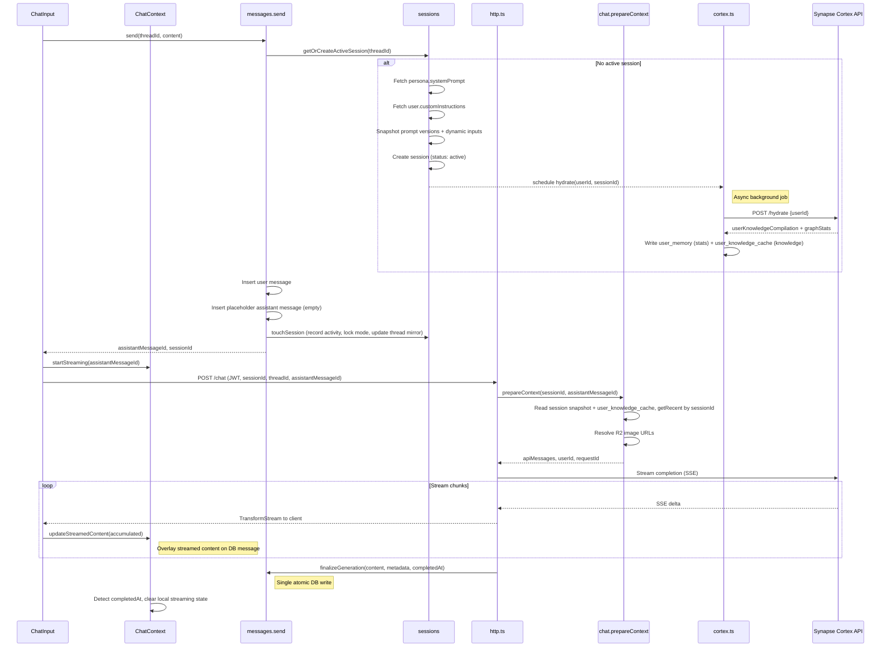
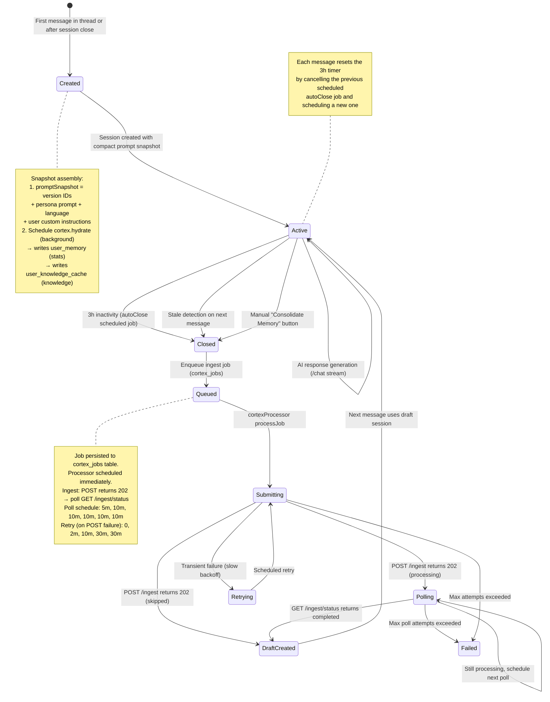
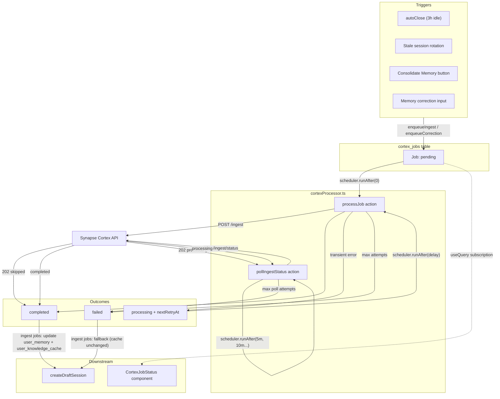
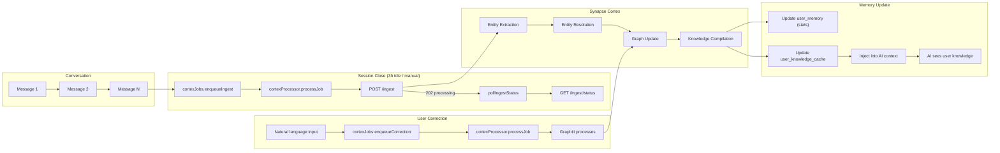

# Synapse AI Chat

A multi-thread, persona-based conversational interface with **deep memory**. Each conversation is linked to a persona (AI personality) and maintains persistent context through a knowledge graph powered by [Graphiti](https://github.com/getzep/graphiti) / Neo4j. Users can visualize, inspect, and correct their knowledge graph in real time.

---

## The story behind Synapse

This project was built and evolved over time, and the journey is documented in a series of articles. If you want to understand the motivation, architectural decisions, and how the system grew from an idea into what it is today, start here:

1. **[My Wife Sent 297 Messages in 15 Days. Not to Me. To the AI I Built Her. The Synapse Story](https://dev.to/juandastic/my-wife-sent-297-messages-in-15-days-not-to-me-to-the-ai-i-built-her-the-synapse-story-333o)** - Start here. This is the story of why Synapse exists, how it became part of our daily lives, and what the project looks like today.
2. **[Beyond RAG: Building an AI Companion with Deep Memory Using Knowledge Graphs](https://dev.to/juandastic/beyond-rag-building-an-ai-companion-with-deep-memory-using-knowledge-graphs-2e6e)** - The first technical version: why traditional RAG wasn't enough and how knowledge graphs became the foundation for persistent AI memory.
3. **[Scaling AI Memory: How I Tamed a 120K Token Prompt with Deterministic GraphRAG](https://dev.to/juandastic/scaling-ai-memory-how-i-tamed-a-120k-token-prompt-with-deterministic-graphrag-4f85)** - How knowledge graph retrieval was optimized to keep prompts manageable as memory grew.
4. **[Full Circle: Giving My AI's Knowledge Graph a Notion Interface Using MCP](https://dev.to/juandastic/full-circle-giving-my-ais-knowledge-graph-a-notion-interface-using-mcp-2dmp)** - How the knowledge graph was exposed through a Notion interface via MCP so users can review and correct their AI's memory.

> **Backend:** The knowledge graph processing, memory compilation, and graph operations are handled by [Synapse Cortex](https://github.com/juandastic/synapse-cortex) — the Python backend that powers the brain behind Synapse. It's an essential piece of the full system.

---

## Table of Contents

- [Overview](#overview)
- [Core Concepts](#core-concepts)
- [Architecture](#architecture)
  - [High-Level System Architecture](#high-level-system-architecture)
  - [Database Schema](#database-schema)
  - [Message Sending Flow](#message-sending-flow)
  - [Session Lifecycle](#session-lifecycle)
  - [Async Cortex Job Queue](#async-cortex-job-queue)
  - [Knowledge Graph Pipeline](#knowledge-graph-pipeline)
- [Features](#features)
  - [Conversational AI](#conversational-ai)
  - [Knowledge Graph & Deep Memory](#knowledge-graph--deep-memory)
  - [Memory Explorer](#memory-explorer)
  - [Notion Export & Corrections](#notion-export--corrections)
  - [Persona System](#persona-system)
  - [UI & UX](#ui--ux)
- [Technical Highlights](#technical-highlights)
- [Project Structure](#project-structure)
- [Tech Stack](#tech-stack)
- [Getting Started](#getting-started)
- [Environment Variables](#environment-variables)
- [Key Implementation Decisions](#key-implementation-decisions)
- [License](#license)

---

## Overview

Synapse AI Chat goes beyond a typical chatbot, it builds and maintains a **persistent knowledge graph** about each user across every conversation. The system automatically ingests conversations into a Neo4j-backed knowledge graph via Synapse Cortex, compiles that knowledge, and injects it into future AI interactions. This gives the AI a continuously evolving understanding of the user, enabling deeply personalized conversations that improve over time.

Users can also **visualize, explore, and correct** their knowledge graph through an interactive force-directed graph, inspect individual entities and relationships, and submit natural language corrections that propagate through the graph.

---

## Core Concepts


```mermaid
graph LR
    P[Persona] -->|"defines AI personality for"| T[Thread]
    T -->|"contains sequential"| S[Session]
    S -->|"snapshots context for"| M[Messages]
    S -->|"ingests into"| KG[Knowledge Graph]
    KG -->|"hydrates into"| S
```


| Concept             | Description                                                                                                                                                                                                                                                  |
| ------------------- | ------------------------------------------------------------------------------------------------------------------------------------------------------------------------------------------------------------------------------------------------------------ |
| **Persona**         | A configuration template defining AI personality: system prompt, identity, icon, and language preference. Users create custom personas or use templates (Therapist, Coach, Friend).                                                                          |
| **Thread**          | A conversation channel immutably linked to a specific persona. All messages within a thread share the same AI personality.                                                                                                                                   |
| **Session**         | An atomic execution unit within a thread. Sessions snapshot the selected prompt versions and dynamic inputs; knowledge is read from the centralized cache. Sessions auto-close after 3 hours of inactivity. |
| **Knowledge Graph** | A Neo4j-backed graph (via Synapse Cortex / Graphiti) that stores compiled knowledge about the user -- facts, relationships, preferences -- extracted from conversations and refined over time.                                                               |


---

## Architecture

### High-Level System Architecture


```mermaid
graph TD
    subgraph client ["Frontend (React 19 + Vite)"]
        AppLayout["AppLayout (shell)"]
        Sidebar["Sidebar (threads)"]
        PersonaSelector["PersonaSelector + MemoryPulse"]
        ChatView["ChatView + MemoryStatus"]
        MemoryExplorer["MemoryExplorer"]
        NotionExportPage["NotionExportPage"]
        PersonaSettings["PersonaSettings"]

        AppLayout --> Sidebar
        AppLayout --> PersonaSelector
        AppLayout --> ChatView
        AppLayout --> MemoryExplorer
        AppLayout --> NotionExportPage
    end

    subgraph convex ["Convex Backend (serverless + realtime)"]
        PersonasAPI["personas.ts"]
        ThreadsAPI["threads.ts"]
        SessionsAPI["sessions.ts"]
        MessagesAPI["messages.ts"]
        HttpAPI["http.ts"]
        ChatAPI["chat.ts"]
        CortexAPI["cortex.ts"]
        GraphAPI["graph.ts"]
        CortexJobs["cortexJobs.ts"]
        CortexProcessor["cortexProcessor.ts"]
        NotionAPI["notion.ts"]
        NotionConfigAPI["notionConfig.ts"]
        UserMemoryAPI["userMemory.ts"]
        UserKnowledgeCacheAPI["userKnowledgeCache.ts"]
    end

    subgraph cortex ["Synapse Cortex (external)"]
        HydrateEndpoint["/hydrate"]
        CompletionEndpoint["/v1/chat/completions"]
        IngestEndpoint["POST /ingest"]
        IngestStatusEndpoint["GET /ingest/status"]
        GraphEndpoint["/v1/graph"]
        CorrectionEndpoint["/v1/graph/correction"]
        NotionExportEndpoint["POST /v1/notion/export"]
        NotionExportStatusEndpoint["GET /v1/notion/export/status"]
        NotionCorrectionsEndpoint["POST /v1/notion/corrections"]
        NotionCorrectionsStatusEndpoint["GET /v1/notion/corrections/status"]
    end

    subgraph db ["Convex Database"]
        UsersTable["users"]
        PersonasTable["personas"]
        ThreadsTable["threads"]
        SessionsTable["sessions"]
        MessagesTable["messages"]
        CortexJobsTable["cortex_jobs"]
        UserMemoryTable["user_memory"]
        UserKnowledgeCacheTable["user_knowledge_cache"]
    end

    subgraph neo4j ["Neo4j (Graphiti)"]
        KG["Knowledge Graph"]
    end

    %% Frontend → Backend
    Sidebar -->|"list threads"| ThreadsAPI
    PersonaSelector -->|"create persona/thread"| PersonasAPI
    PersonaSelector -->|"create thread"| ThreadsAPI
    ChatView -->|"list messages"| MessagesAPI
    ChatView -->|"send message"| MessagesAPI
    ChatView -->|"HTTP stream /chat"| HttpAPI
    ChatView -->|"consolidate memory"| SessionsAPI
    PersonaSelector -->|"memory stats"| UserMemoryAPI
    ChatView -->|"memory stats"| UserMemoryAPI
    MemoryExplorer -->|"fetch graph"| GraphAPI
    MemoryExplorer -->|"submit correction"| GraphAPI
    MemoryExplorer -->|"subscribe job status"| CortexJobs
    NotionExportPage -->|"read/save config"| NotionConfigAPI
    NotionExportPage -->|"start export / poll status"| NotionAPI
    NotionExportPage -->|"start corrections / poll status"| NotionAPI
    PersonaSettings -->|"CRUD"| PersonasAPI

    %% Backend orchestration
    MessagesAPI -->|"get/create session"| SessionsAPI
    HttpAPI -->|"prepareContext"| ChatAPI
    HttpAPI -->|"finalizeGeneration"| MessagesAPI
    ChatAPI -->|"read session snapshot"| SessionsAPI
    SessionsAPI -->|"schedule hydrate"| CortexAPI
    SessionsAPI -->|"enqueue ingest"| CortexJobs
    GraphAPI -->|"enqueue correction"| CortexJobs
    NotionAPI -->|"POST export"| NotionExportEndpoint
    NotionAPI -->|"GET export status"| NotionExportStatusEndpoint
    NotionAPI -->|"POST corrections"| NotionCorrectionsEndpoint
    NotionAPI -->|"GET corrections status"| NotionCorrectionsStatusEndpoint

    %% Async job queue
    CortexJobs -->|"schedule"| CortexProcessor
    CortexProcessor -->|"POST /ingest (202)"| IngestEndpoint
    CortexProcessor -->|"poll GET /ingest/status"| IngestStatusEndpoint
    CortexProcessor -->|"POST /correction"| CorrectionEndpoint
    CortexProcessor -->|"create draft"| SessionsAPI
    ChatAPI -->|"read knowledge"| UserKnowledgeCacheAPI

    %% Direct Cortex calls (fast, no queue needed)
    CortexAPI -->|"POST /hydrate"| HydrateEndpoint
    HttpAPI -->|"stream completion"| CompletionEndpoint
    GraphAPI -->|"GET graph"| GraphEndpoint

    %% Data layer
    PersonasAPI --> PersonasTable
    ThreadsAPI --> ThreadsTable
    SessionsAPI --> SessionsTable
    MessagesAPI --> MessagesTable
    CortexJobs --> CortexJobsTable
    CortexAPI --> UserMemoryTable
    CortexAPI --> UserKnowledgeCacheTable
    CortexProcessor --> UserMemoryTable
    CortexProcessor --> UserKnowledgeCacheTable

    %% External services
    HydrateEndpoint --> KG
    IngestEndpoint --> KG
    IngestStatusEndpoint --> KG
    GraphEndpoint --> KG
    CorrectionEndpoint --> KG
```

**Data flow summary:**

1. **Frontend** communicates with Convex through reactive queries/mutations, server actions, and the `/chat` HTTP streaming endpoint.
2. **Convex backend** orchestrates session management, message persistence, and AI generation.
3. **Cortex job queue** decouples heavy AI processing (ingestion, corrections) from the UI. Jobs are persisted in `cortex_jobs`. Ingest uses async API (POST 202 → poll status); failures retry with slow backoff.
4. **Synapse Cortex** serves as the bridge to the Neo4j knowledge graph -- handling hydration (reads), ingestion (writes), graph queries, and NLP-based corrections.
5. **Neo4j / Graphiti** stores the actual knowledge graph, processing entity extraction and relationship management.

---

### Database Schema


```mermaid
erDiagram
    users {
        string tokenIdentifier
        string name
        string customInstructions_optional
        string notionToken_optional
        string notionPageName_optional
        string notionLanguage_optional
    }
    personas {
        id userId
        string name
        string description
        string language
        string systemPrompt
        string icon
        boolean isDefault
    }
    threads {
        id userId
        id personaId
        id activeSessionId
        string title
        string activePromptMode
        number activePromptModeLockedAt
        number lastMessageAt
    }
    sessions {
        id userId
        id threadId
        string status
        string promptMode
        object promptSnapshot
        number startedAt
        number endedAt
        number lastMessageAt
        id closerJobId
    }
    messages {
        id threadId
        id sessionId
        string role
        string content
        array imageKeys
        string type
        number completedAt
        object metadata
    }
    cortex_jobs {
        id userId
        id sessionId_optional
        string type
        any payload
        string status
        number attempts
        number maxAttempts
        string lastError
        number nextRetryAt
        number createdAt
        number updatedAt
    }
    monthly_usage {
        id userId
        string month
        number totalChatMessages
        number totalChatCharsGenerated
        number totalInputTokens
        number totalOutputTokens
        number totalIngestions
        number totalCorrections
        number totalIngestedChars
        any dailyStats
    }
    user_memory {
        id userId
        number entityCount
        number relationshipCount
        number includedEntityCount
        number includedRelationshipCount
        number totalChars
        number totalTokens
        boolean isPartial
        number lastUpdatedAt
    }
    user_knowledge_cache {
        id userId
        string cachedUserKnowledge
        any compilationMetadata
        number lastUpdatedAt
    }

    users ||--o{ personas : owns
    users ||--o{ threads : owns
    users ||--o{ cortex_jobs : owns
    users ||--o{ monthly_usage : tracks
    personas ||--o{ threads : "used by"
    threads ||--o{ sessions : contains
    threads ||--o{ messages : contains
    sessions ||--o{ messages : groups
    sessions ||--o{ cortex_jobs : "ingest jobs"
    users ||--|| user_memory : "has stats"
    users ||--|| user_knowledge_cache : "has knowledge"
```

Key points:

- **New sessions** store a compact `promptSnapshot`: version identifiers plus persona, language, and user-instruction inputs. Historical sessions keep their frozen `cachedSystemPrompt` and use it directly, so introducing the versioned format requires no data migration.
- **Threads** mirror only the active session ID, prompt mode, and lock timestamp. The chat UI reads these small fields through its existing thread subscription instead of subscribing to the full session snapshot. Threads created before the mirror fall back to one session lookup until their next message.
- **User memory** (`user_memory`) stores lightweight graph stats (~200 bytes) — entity/relationship counts, token estimates, and whether RAG is active (`isPartial`). This is the only table the frontend subscribes to, keeping reactive query bandwidth minimal.
- **User knowledge cache** (`user_knowledge_cache`) stores the heavy compiled knowledge string (~30K) and `compilationMetadata`. Only read by the backend (`chat.prepareContext`) — never exposed to the frontend.
- **2-table split rationale**: Convex charges per full document read regardless of field projection. Separating lightweight stats from the heavy knowledge blob means the frontend subscription reads ~200 bytes instead of ~30K on every update.
- **Messages** store analytics in `metadata`: token counts, latency, cost, finish reason, error details, and RAG recall stats (`ragEnabled`, `ragNodes`, `ragEdges`).
- **Cortex jobs** decouple heavy AI calls from the UI. Status lifecycle: `pending` → `processing` → `completed` | `failed`. Ingest: POST returns 202, poll GET /ingest/status (5m, 10m×5). Retry on POST failure: 0 → 2m → 10m → 30m → 30m.
- **Session status** is primarily `active`/`closed` in runtime flow. `processing` exists in schema for guarded transitions but is not part of the current `/chat` streaming path.

---

### Message Sending Flow


```mermaid
sequenceDiagram
    participant UI as ChatInput
    participant Ctx as ChatContext
    participant Msg as messages.send
    participant Sess as sessions
    participant Http as http.ts
    participant Chat as chat.prepareContext
    participant Cortex as cortex.ts
    participant API as Synapse Cortex API

    UI->>Msg: send(threadId, content)
    Msg->>Sess: getOrCreateActiveSession(threadId)

    alt No active session
        Sess->>Sess: Fetch persona.systemPrompt
        Sess->>Sess: Fetch user.customInstructions
        Sess->>Sess: Snapshot prompt versions + dynamic inputs
        Sess->>Sess: Create session (status: active)
        Sess-->>Cortex: schedule hydrate(userId, sessionId)
        Note right of Cortex: Async background job
        Cortex->>API: POST /hydrate {userId}
        API-->>Cortex: userKnowledgeCompilation + graphStats
        Cortex->>Cortex: Write user_memory (stats) + user_knowledge_cache (knowledge)
    end

    Msg->>Msg: Insert user message
    Msg->>Msg: Insert placeholder assistant message (empty)
    Msg->>Sess: touchSession (record activity, lock mode, update thread mirror)
    Msg-->>UI: assistantMessageId, sessionId

    UI->>Ctx: startStreaming(assistantMessageId)
    UI->>Http: POST /chat (JWT, sessionId, threadId, assistantMessageId)

    Http->>Chat: prepareContext(sessionId, assistantMessageId)
    Chat->>Chat: Read session snapshot + user_knowledge_cache, getRecent by sessionId
    Chat->>Chat: Resolve R2 image URLs
    Chat-->>Http: apiMessages, userId, requestId

    Http->>API: Stream completion (SSE)
    loop Stream chunks
        API-->>Http: SSE delta
        Http-->>UI: TransformStream to client
        UI->>Ctx: updateStreamedContent(accumulated)
        Note right of Ctx: Overlay streamed content on DB message
    end

    Http->>Msg: finalizeGeneration(content, metadata, completedAt)
    Note right of Msg: Single atomic DB write
    Ctx->>Ctx: Detect completedAt, clear local streaming state
```

**Key details:**

- Zero database writes during streaming — content is streamed directly to the client via HTTP.
- Single atomic DB write at the end persists content + metadata.
- Frontend overlays locally streamed content on the DB message; once `completedAt` is set, DB content becomes authoritative.
- `getRecent` fetches messages by `sessionId` (previous sessions are ingested into Cortex knowledge).

---

### Session Lifecycle


```mermaid
stateDiagram-v2
    [*] --> Created: First message in thread or after session close
    Created --> Active: Session created with compact prompt snapshot

    Active --> Active: Messages sent (touch resets 3h timer)
    Active --> Active: AI response generation (/chat stream)
    Active --> Closed: 3h inactivity (autoClose scheduled job)
    Active --> Closed: Stale detection on next message
    Active --> Closed: Manual "Consolidate Memory" button

    Closed --> Queued: Enqueue ingest job (cortex_jobs)
    Queued --> Submitting: cortexProcessor processJob
    Submitting --> Polling: POST /ingest returns 202 (processing)
    Submitting --> DraftCreated: POST /ingest returns 202 (skipped)
    Polling --> DraftCreated: GET /ingest/status returns completed
    Polling --> Polling: Still processing, schedule next poll
    Polling --> Failed: Max poll attempts exceeded
    Submitting --> Retrying: Transient failure (slow backoff)
    Retrying --> Submitting: Scheduled retry
    Submitting --> Failed: Max attempts exceeded
    DraftCreated --> Active: Next message uses draft session

    note right of Created
        Snapshot assembly:
        1. promptSnapshot = version IDs
           + persona prompt + language
           + user custom instructions
        2. Schedule cortex.hydrate (background)
           → writes user_memory (stats)
           → writes user_knowledge_cache (knowledge)
    end note

    note right of Queued
        Job persisted to cortex_jobs table.
        Processor scheduled immediately.
        Ingest: POST returns 202 → poll GET /ingest/status
        Poll schedule: 5m, 10m, 10m, 10m, 10m, 10m
        Retry (on POST failure): 0, 2m, 10m, 30m, 30m
    end note

    note left of Active
        Each message resets the 3h timer
        by cancelling the previous scheduled
        autoClose job and scheduling a new one
    end note
```

**Why sessions matter:**

- **Snapshot isolation**: Sessions freeze prompt versions and dynamic inputs, then render the full prompt at generation time. Persona changes do not affect an ongoing conversation. Knowledge is read from `user_knowledge_cache` at generation time.
- **Knowledge evolution**: When a session closes, its messages are ingested into the knowledge graph. Both `user_memory` (stats) and `user_knowledge_cache` (knowledge) are updated, and the next session automatically uses the latest knowledge.
- **Race condition handling**: If a user sends a message while ingestion is creating a draft session, the system detects the existing active session and updates it instead of creating a duplicate.

---

### Async Cortex Job Queue

Heavy Cortex API calls (ingestion: 30-200s, corrections: 30-60s) are decoupled from the UI via a persistent job queue. This prevents timeouts, handles transient AI provider failures (Gemini 503s), and gives users real-time visibility into processing status.


```mermaid
flowchart TD
    subgraph triggers [Triggers]
        T1["autoClose (3h idle)"]
        T2["Stale session rotation"]
        T3["Consolidate Memory button"]
        T4["Memory correction input"]
    end

    subgraph queue ["cortex_jobs table"]
        JOB["Job: pending"]
    end

    subgraph processor ["cortexProcessor.ts"]
        PROC["processJob action"]
        POLL["pollIngestStatus action"]
    end

    subgraph outcomes [Outcomes]
        OK["completed"]
        RETRY["processing + nextRetryAt"]
        FAIL["failed"]
    end

    subgraph downstream [Downstream]
        DRAFT["createDraftSession"]
        UI["CortexJobStatus component"]
    end

    triggers -->|"enqueueIngest / enqueueCorrection"| JOB
    JOB -->|"scheduler.runAfter(0)"| PROC
    PROC -->|"POST /ingest"| INGEST_API["Synapse Cortex API"]
    INGEST_API -->|"202 skipped"| OK
    INGEST_API -->|"202 processing"| POLL
    PROC --> OK
    PROC -->|"transient error"| RETRY
    RETRY -->|"scheduler.runAfter(delay)"| PROC
    PROC -->|"max attempts"| FAIL

    POLL -->|"GET /ingest/status"| INGEST_API
    INGEST_API -->|"completed"| OK
    INGEST_API -->|"processing"| POLL
    POLL -->|"scheduler.runAfter(5m, 10m...)"| POLL
    POLL -->|"max poll attempts"| FAIL

    OK -->|"ingest jobs: update user_memory + user_knowledge_cache"| DRAFT
    FAIL -->|"ingest jobs: fallback (cache unchanged)"| DRAFT
    JOB -.->|"useQuery subscription"| UI
```

**Ingest flow (async API):**

1. **POST /ingest** — submit session + messages; returns `202 Accepted` with `status: "processing"` or `"skipped"`.
2. **Skipped** — too few messages; `userKnowledgeCompilation` returned immediately → update `user_knowledge_cache`, create draft, done.
3. **Processing** — schedule `pollIngestStatus` to poll `GET /ingest/status/{jobId}` until completed or failed.

**Poll schedule (ingest status — linear, no exponential backoff):**

| Poll   | Delay   | Cumulative |
| ------ | ------- | ---------- |
| 0      | 5 min   | 5 min      |
| 1–5    | 10 min  | 15–55 min  |

**Retry schedule (POST /ingest or correction failures — slow backoff):**

| Attempt | Delay    |
| ------- | -------- |
| 1       | Immediate |
| 2       | +2 min   |
| 3       | +10 min  |
| 4       | +30 min  |
| 5       | +30 min (final) |

**Key design decisions:**

- **Throws = retryable, returns = graceful.** The processor distinguishes between transient failures (HTTP 503, network errors) that warrant retry and non-retryable cases (no messages, content blocked) that resolve with fallback knowledge.
- **Fallback draft on permanent failure.** Even if all 5 attempts fail, the thread always gets a usable draft session. `user_knowledge_cache` retains the latest knowledge from the previous successful hydration/ingest.
- **Real-time UI subscriptions.** The frontend subscribes to `cortexJobs.getActiveByUser` via Convex reactive queries, giving instant status updates without polling.
- **Manual retry.** Users can retry failed jobs from the Memory Explorer UI.

---

### Knowledge Graph Pipeline


```mermaid
flowchart LR
    subgraph conversation ["Conversation"]
        M1["Message 1"] --> M2["Message 2"] --> M3["Message N"]
    end

    subgraph sessionClose ["Session Close (3h idle / manual)"]
        M3 --> ENQUEUE["cortexJobs.enqueueIngest"]
        ENQUEUE --> PROC["cortexProcessor.processJob"]
        PROC --> POST["POST /ingest"]
        POST -->|"202 processing"| POLL["pollIngestStatus"]
        POLL --> STATUS["GET /ingest/status"]
    end

    subgraph cortexProcessing ["Synapse Cortex"]
        POST --> EXTRACT["Entity Extraction"]
        EXTRACT --> RESOLVE["Entity Resolution"]
        RESOLVE --> UPDATE["Graph Update"]
        UPDATE --> COMPILE["Knowledge Compilation"]
    end

    subgraph memoryUpdate ["Memory Update"]
        COMPILE --> STATS["Update user_memory (stats)"]
        COMPILE --> CACHE["Update user_knowledge_cache"]
        CACHE --> INJECT["Inject into AI context"]
        INJECT --> AI["AI sees user knowledge"]
    end

    subgraph correction ["User Correction"]
        NL["Natural language input"] --> CORRECT["cortexJobs.enqueueCorrection"]
        CORRECT --> CORRPROC["cortexProcessor.processJob"]
        CORRPROC --> GRAPHITI["Graphiti processes"]
        GRAPHITI --> UPDATE
    end
```

**Pipeline stages:**

1. **Conversation**: User interacts with AI within a session. Messages accumulate.
2. **Ingestion** (on session close): An ingest job is enqueued in `cortex_jobs`. The processor sends all session messages to Cortex `POST /ingest`, which returns `202 Accepted` with `status: "processing"` or `"skipped"`. When processing, `pollIngestStatus` polls `GET /ingest/status/{jobId}` (5m, then 10m intervals) until completion. Cortex processes messages through Graphiti — extracting entities, resolving duplicates, and updating the Neo4j graph. On completion, both `user_memory` (stats from `graphStats`) and `user_knowledge_cache` (knowledge) are updated. Failures are retried with slow backoff.
3. **Hydration** (on session creation): A background action calls `POST /hydrate` to compile the latest knowledge. The result updates both `user_memory` (graph stats) and `user_knowledge_cache` (compiled knowledge). No per-session storage — knowledge is centralized per user.
4. **Correction** (user-initiated): A correction job is enqueued in `cortex_jobs`. Users submit natural language corrections (e.g., *"I no longer live in Colombia, I moved to Canada"*) that Graphiti processes to invalidate outdated edges and create new ones.

**Graceful degradation:**

- If hydration fails → session continues without knowledge (works fine, just less personalized). `user_knowledge_cache` retains previous knowledge.
- If ingestion fails after all retries → fallback draft created. `user_knowledge_cache` already has the latest knowledge from the previous hydration.
- If correction fails after all retries → job marked as failed, user can retry from Memory Explorer.
- If graph fetch fails → Memory Explorer shows empty graph with no errors.

---

## Features

### Conversational AI

- **Multi-Thread Conversations**: Create multiple threads, each with a dedicated persona and independent history.
- **Real-time Streaming**: HTTP streaming directly to the client with zero intermediate DB writes; single atomic write at the end. ChatContext overlays streamed content locally for smooth, character-by-character rendering.
- **Session-Scoped Context**: The AI sees all messages from the current `sessionId`; cross-session continuity comes from `user_knowledge_cache`.
- **Session Snapshotting**: Version IDs and dynamic prompt inputs ensure consistency without storing the rendered system prompt per session.
- **Smart Auto-scroll**: Auto-scrolls to bottom on new messages, with scroll-to-bottom button when scrolled up.
- **Markdown Rendering**: Rich markdown support with streaming animation via Streamdown.
- **Error Categorization**: Structured error types (CONFIG_ERROR, API_ERROR, PROVIDER_ERROR) with user-friendly messages and technical details in metadata.
- **Analytics Tracking**: Per-message token counts, latency, cost, and finish reason stored in metadata.

### Knowledge Graph & Deep Memory

- **Automatic Knowledge Extraction**: Closed sessions are automatically ingested into the knowledge graph, extracting entities and relationships from conversations.
- **Async Cortex Job Queue**: Heavy AI operations (ingestion, corrections) are decoupled from the UI via a persistent job queue. Ingest uses async API: POST returns 202, then poll GET /ingest/status (5m, 10m×5). POST/correction failures retry with slow backoff (5 attempts: 0 → 2m → 10m → 30m → 30m).
- **Real-time Job Status**: Users see live processing status (pending, processing, retrying with countdown, failed with retry button) via Convex reactive subscriptions.
- **Manual Memory Consolidation**: "Consolidate Memory" button in the chat UI force-closes the active session and enqueues an ingest job immediately.
- **Knowledge Hydration**: On session creation, a background action compiles the latest knowledge and updates both `user_memory` (stats) and `user_knowledge_cache` (knowledge).
- **Knowledge Compilation**: Cortex compiles raw graph data into a structured text summary injected into the AI's context window. When the graph exceeds the compilation budget, `isPartial` is set and GraphRAG activates to retrieve long-tail memories.
- **Centralized Memory Store**: Knowledge is stored once per user in `user_knowledge_cache` (not per session), eliminating ~30K string duplication across sessions.
- **Memory Awareness UI**: Real-time memory stats visible throughout the app:
  - **Memory Pulse** (home screen): Shows total memories count, token estimate, and contextual description.
  - **Memory Status** (chat header): Compact indicator with expandable tooltip showing included vs total memories and RAG activation.
  - **RAG Recall Badge** (per-message): Shows how many memories were consulted for the last assistant response.
- **2-Table Split Optimization**: Lightweight stats (~200 bytes in `user_memory`) separated from heavy knowledge blob (~30K in `user_knowledge_cache`) to minimize Convex reactive query bandwidth.
- **Early Return Optimization**: `userMemory.upsert` skips `db.patch` when stats haven't changed, avoiding unnecessary reactive subscription triggers.
- **Draft Session Pre-loading**: After ingestion, a draft session is pre-created, ready for the next interaction.
- **Race Condition Handling**: Concurrent session creation during knowledge processing is detected and handled gracefully.
- **Graceful Degradation**: Every stage fails safely — sessions work without knowledge, ingestion failures leave `user_knowledge_cache` intact with previous knowledge, corrections can be retried.

### Memory Explorer

- **Interactive Graph Visualization**: Force-directed graph (via `react-force-graph-2d`) renders entities as nodes and relationships as edges.
- **Node Inspection**: Click any entity to see its name, summary, connection count, and all incoming/outgoing relationships with fact labels.
- **Entity Search**: Searchable, filterable entity list sorted by connection count, with click-to-center navigation.
- **Natural Language Corrections**: Submit corrections like *"I no longer work at Google, I joined Meta"* -- enqueued as a background job and processed by Graphiti to invalidate outdated edges and create new relationships.
- **Cortex Job Status Panel**: Real-time display of active ingestion and correction jobs with processing spinners, polling countdown ("next check in ~Xm"), retry countdown after failures, and manual retry for failed jobs.
- **Real-time Refresh**: Graph auto-refreshes after corrections. Manual refresh available.
- **Responsive Layout**: Desktop shows entity list + graph + inspector side by side. Mobile uses full-width graph with bottom-sheet inspector.
- **Custom Rendering**: Nodes sized by connection count, selection highlighting with glow effects, labels appear on zoom.

### Notion Export & Corrections

- **Knowledge Graph Export**: Export the full user knowledge graph into structured Notion databases. Synapse Cortex reads the Neo4j graph, designs AI-tailored schemas per category (using Gemini structured output), creates one Notion database per category under a parent page, populates all rows via the Notion MCP server, and generates a "Knowledge Graph Overview" summary page with links.
- **Async Export Pipeline**: Export is a 6-step async job (`hydrating → analyzing → extracting_entries → creating_databases → populating → summarizing`). The UI polls `GET /v1/notion/export/status/{jobId}` every 30 seconds, showing live step progress and running stats (categories designed, entries extracted).
- **Sync Corrections from Notion**: After an export, users can flag rows in Notion as "Needs Review" and then trigger a corrections sync. Cortex scans all exported databases for flagged rows, applies each correction back to the knowledge graph via Graphiti (`add_episode`), and updates or archives the Notion row via MCP.
- **Corrections Pipeline**: Corrections run as a 2-step async job (`scanning → applying`). The UI polls `GET /v1/notion/corrections/status/{jobId}`, showing live counts of databases scanned, corrections found, and corrections applied. Partial failures are surfaced per-row (category, title, error).
- **Config Persistence**: Notion integration token, parent page name, and output language are saved to the user record on first export and pre-filled on every subsequent visit.
- **In-app Setup Guide**: A modal explains how to create a Notion internal integration, copy the token, and grant page access — with a direct link to `notion.so/profile/integrations/internal`.
- **Graceful Error Handling**: Token/page validation errors from Cortex (400) surface immediately in the config form. Job 404s (job consumed after terminal state) stop polling without infinite retries.

---

### Persona System

- **Template Personas**: Pre-built personalities (Therapist, Coach, Friend) with tailored system prompts.
- **Custom Personas**: Full CRUD for creating personas with custom name, description, system prompt, icon (emoji), and language preference.
- **Language Enforcement**: Per-persona language preference is compiled into the system prompt.
- **Custom Instructions**: Global user instructions applied across all personas.
- **Inline Selection**: Full-width card grid for choosing personas (no modal), directly creates thread and navigates.

---

## Technical Highlights


| Area                      | Detail                                                                                                  |
| ------------------------- | ------------------------------------------------------------------------------------------------------- |
| **Realtime**              | Convex reactive queries auto-update UI when DB changes -- no polling, no WebSocket management           |
| **Streaming**             | HTTP streaming to client; local state overlay during generation; single DB write at end; frontend derives `isGenerating` from message state |
| **Session snapshot**      | Compact version and input snapshot decouples conversations from persona changes without duplicating shared prompt text |
| **Memory awareness**      | 2-table split: `user_memory` (stats, ~200B, frontend) + `user_knowledge_cache` (knowledge, ~30K, backend only). Early return skips writes when unchanged. |
| **Knowledge pipeline**    | Hydrate on create → conversation → enqueue ingest on close → POST /ingest (202) → poll status → update user_memory + user_knowledge_cache → draft |
| **Async job queue**       | Persistent `cortex_jobs` table; ingest: POST returns 202, poll GET /ingest/status (5m, 10m×5); retry on POST failure (5 attempts); real-time UI |
| **Auto-close timer**      | 3h debounced via Convex scheduled functions; each message cancels previous and reschedules              |
| **Cross-session context** | Messages queried by `threadId` (not `sessionId`) for full thread continuity                             |
| **Graph visualization**   | `react-force-graph-2d` with d3-force physics, custom rendering, imperative camera API                   |
| **NLP corrections**       | Natural language graph corrections via Graphiti entity resolution                                       |
| **Error handling**        | Categorized errors (CONFIG, API, PROVIDER, PARSE, UNKNOWN) with user-friendly + technical messages      |
| **Performance**           | `content-visibility: auto`, `React.memo`, passive listeners, throttled updates, efficient DB indexes    |
| **Auth**                  | Clerk JWT verification on every Convex mutation/query; identity-scoped data access                      |
| **Cascade deletes**       | Thread deletion removes all sessions + messages in a single mutation                                    |


---

## Project Structure

```
synapse-ai-chat/
├── packages/
│   └── backend/
│       └── convex/                       # Convex backend (serverless functions + database)
│           ├── schema.ts                 # Database schema (9 tables, indexed; includes user_memory + user_knowledge_cache)
│           ├── users.ts                  # User management + customInstructions
│           ├── personas.ts               # Persona CRUD + default templates
│           ├── threads.ts                # Thread CRUD + cascade delete
│           ├── sessions.ts               # Session lifecycle (3h auto-close, snapshot, forceClose, draft creation)
│           ├── messages.ts               # Message mutations/queries (streaming support, analytics)
│           ├── http.ts                   # HTTP streaming endpoint (direct client streaming, single DB write)
│           ├── chat.ts                   # Context preparation (reads user_knowledge_cache, session snapshot, R2 URLs)
│           ├── cortex.ts                 # Cortex integration (hydrate → user_memory + user_knowledge_cache)
│           ├── cortexJobs.ts             # Job queue management (enqueue, status, retry)
│           ├── cortexProcessor.ts        # Job processor (ingest + poll → user_memory + user_knowledge_cache; correction; retry)
│           ├── userMemory.ts             # User memory stats (public query for frontend, internal upsert with early return)
│           ├── userKnowledgeCache.ts     # User knowledge cache (internal only — never exposed to frontend)
│           ├── graph.ts                  # Knowledge graph queries + NLP corrections
│           ├── notion.ts                 # Notion actions: startExport, getExportStatus, startCorrections, getCorrectionsStatus
│           ├── notionConfig.ts           # Notion config query/mutation
│           └── auth.config.ts            # Clerk auth configuration
├── apps/
│   ├── web/src/                          # Web frontend (React 19 + Vite)
│   │   ├── components/
│   │   │   ├── chat/
│   │   │   │   ├── ChatView.tsx           # Thread chat view + MemoryStatus indicator (route: /t/:threadId)
│   │   │   │   ├── ChatInput.tsx          # Message input with threadId
│   │   │   │   ├── MessageList.tsx        # Messages with auto-scroll + isLast tracking
│   │   │   │   ├── MessageItem.tsx        # Message rendering (streaming, RagBadge on last message)
│   │   │   │   ├── MemoryPulse.tsx        # Home screen memory stats (entity+relationship count, tokens, description)
│   │   │   │   ├── PersonaSelector.tsx    # Inline persona selection + MemoryPulse (route: /)
│   │   │   │   └── SessionDivider.tsx     # Visual session separator
│   │   │   ├── memory/                    # Knowledge graph visualization
│   │   │   ├── notion/                    # Notion export & corrections
│   │   │   ├── layout/                    # AppLayout shell
│   │   │   ├── settings/                  # Persona CRUD
│   │   │   ├── sidebar/                   # Thread list + navigation
│   │   │   └── ui/                        # Reusable UI primitives (shadcn, sonner)
│   │   ├── contexts/                      # ChatContext, ThemeContext
│   │   ├── hooks/                         # useStreamResponse, etc.
│   │   ├── i18n/locales/{en,es}/          # Internationalization (EN + ES)
│   │   └── lib/                           # Utils, markdown security
│   └── mobile/src/                        # Mobile frontend (Expo + React Native)
│       ├── components/
│       │   ├── MessageList.tsx            # Messages (inverted FlatList, session dividers, isLast tracking)
│       │   ├── MessageItem.tsx            # Message rendering (streaming, RagBadge on last message)
│       │   ├── MemoryPulse.tsx            # Home screen memory stats (native)
│       │   └── ...                        # Other native components
│       ├── app/(home)/
│       │   ├── index.tsx                  # Home + PersonaSelector + MemoryPulse
│       │   └── [threadId].tsx             # Chat view + MobileMemoryStatus
│       └── i18n/locales/{en,es}/          # Internationalization (EN + ES)
└── package.json
```

---

## Tech Stack


| Layer                   | Technology                                                         |
| ----------------------- | ------------------------------------------------------------------ |
| **Web Frontend**        | React 19, TypeScript, Vite, React Router DOM                       |
| **Mobile Frontend**     | Expo (React Native), TypeScript, Expo Router                       |
| **Styling (Web)**       | TailwindCSS, Shadcn/UI components, Sonner (toasts)                 |
| **Backend**             | Convex (realtime database + serverless functions + scheduled jobs) |
| **Auth**                | Clerk (JWT-based, verified on every backend call)                  |
| **LLM**                 | Synapse Cortex API (OpenRouter-compatible, uses Gemini 2.5 Flash)  |
| **Knowledge Graph**     | Synapse Cortex → Graphiti → Neo4j                                  |
| **Graph Visualization** | react-force-graph-2d (d3-force)                                    |
| **Markdown**            | Streamdown (streaming-aware markdown rendering)                    |


---

## Getting Started

### Prerequisites

- Node.js 18+
- npm or pnpm
- Convex account ([free tier available](https://www.convex.dev/))
- Clerk account ([free tier available](https://clerk.com/))
- Synapse Cortex API access (or compatible OpenRouter API)

### Setup

1. **Install dependencies:**
  ```bash
   npm install
  ```
2. **Initialize Convex:**
  ```bash
   npx convex dev
  ```
   This will prompt you to create a new Convex project and will generate the `_generated` folder.
3. **Configure environment variables:**
  Create a `.env.local` file based on `.env.local.example`:
   Fill in your values (see [Environment Variables](#environment-variables) below).
4. **Configure Clerk in Convex:**
  In the Convex dashboard, go to Settings > Environment Variables and add the server-side variables.
5. **Start development:**
  ```bash
   # Terminal 1: Convex dev server (watches for schema/function changes)
   npx convex dev

   # Terminal 2: Vite dev server
   npm run dev
  ```
6. Open [http://localhost:5173](http://localhost:5173)

---

## Environment Variables


| Variable                     | Location         | Description                                                           |
| ---------------------------- | ---------------- | --------------------------------------------------------------------- |
| `VITE_CONVEX_URL`            | `.env.local`     | Convex deployment URL (shown after `npx convex dev`)                  |
| `VITE_CLERK_PUBLISHABLE_KEY` | `.env.local`     | Clerk publishable key (from Clerk dashboard)                          |
| `CLERK_JWT_ISSUER_DOMAIN`    | Convex dashboard | Clerk JWT issuer domain (e.g., `https://your-app.clerk.accounts.dev`) |
| `SYNAPSE_CORTEX_API_SECRET`  | Convex dashboard | Synapse Cortex API secret key                                         |


---

## Key Implementation Decisions

1. **Session auto-close timer: 3 hours** — balances conversational coherence with knowledge graph freshness. Shorter timers mean more frequent ingestion.
2. **Centralized user knowledge** — knowledge is stored once per user in `user_knowledge_cache`, not per session. Eliminates ~30K string duplication. `chat.prepareContext` reads from the cache with a backwards-compat fallback to legacy session fields.
3. **2-table memory split** — `user_memory` (~200 bytes, stats only) is the only table the frontend subscribes to. `user_knowledge_cache` (~30K, knowledge blob) is internal-only. This minimizes Convex reactive query bandwidth since Convex charges per full document read regardless of field projection.
4. **Early return on unchanged stats** — `userMemory.upsert` compares all fields before calling `db.patch`. If nothing changed (common during re-hydration), the write is skipped entirely, preventing unnecessary reactive subscription triggers.
5. **Single Cortex call per ingest** — `graphStats` is included in the `IngestStatusResponse`, so the poll completion path writes both tables directly without a separate hydration call.
6. **Knowledge hydration via `/hydrate`** — scheduled as a background action on session creation. Compiles knowledge and graph stats in one call, updating both `user_memory` and `user_knowledge_cache`.
7. **Session-scoped message context** — `getRecent` fetches the last 20 messages by `sessionId` for the current session only. Previous sessions are already ingested into Cortex, so cross-session continuity comes from the knowledge graph (`user_knowledge_cache`) rather than raw message history.
8. **Inline persona selection (no modal)** — content area shows `PersonaSelector` card grid. Selecting one creates the thread and navigates directly.
9. **Thread deletion cascade** — deletes all sessions + messages for the thread in a single mutation.
10. **NLP-based memory corrections** — instead of manual entity editing, users submit natural language corrections that Graphiti processes through its entity resolution pipeline.
11. **Async job queue over fire-and-forget** — Cortex API calls (ingestion: 30-200s, corrections: 30-60s) are too slow and unreliable for synchronous execution. Ingest uses an async API: POST /ingest returns 202 immediately, and `pollIngestStatus` polls GET /ingest/status until completed (5m first, then 10m intervals, up to ~55 min). A persistent `cortex_jobs` table with a recursive processor gives resilience (slow-backoff retry on POST failures), observability (real-time UI), and auditability (job history). The "bouncer" pattern (enqueue + schedule immediately) minimizes latency while decoupling from the caller.
12. **Routing:** `react-router-dom` with paths `/`, `/t/:threadId`, `/settings/personas`, `/memory`, and `/notion`. Sidebar persists via `AppLayout` with `<Outlet />`.
13. **React performance patterns:** `content-visibility: auto` for message lists, `useTransition` for form submissions, `React.memo` for thread items, functional setState, passive scroll listeners.
14. **HTTP streaming for bandwidth optimization** — streaming bypasses the DB entirely during generation; content flows directly from Cortex to the client via HTTP. A single atomic write at the end persists the result. This reduces reactive query re-execution from N writes to 1, lowering Convex bandwidth usage.
15. **Hybrid knowledge strategy** — full-context injection by default, with deterministic GraphRAG for large graphs. See details below.

### Hybrid Knowledge Strategy: Full-Context + GraphRAG

Synapse uses a **hybrid approach** to inject user knowledge into the AI's context:

1. **Full-context injection by default.** For small-to-medium knowledge graphs, the entire compiled knowledge is injected into the system prompt. This gives the LLM the full picture — it can draw connections between seemingly unrelated facts without needing to "ask" for specific data. Graphiti's graph maintenance keeps the compilation condensed: invalidated nodes are pruned, disconnected nodes are ignored, and the output is a structured summary (not raw conversation logs).

2. **Deterministic GraphRAG for large graphs.** When the knowledge graph exceeds the compilation budget (~30K chars), Cortex's v2 hydration activates **prioritized compilation**: entities and relationships are ranked by relevance, and only the most important ones are included in the base context. The `isPartial` flag is set to `true`, and GraphRAG activates to retrieve long-tail memories on demand. The UI surfaces this via the **Memory Status** indicator ("Dynamic recall active") and **RAG Recall Badge** ("X memories recalled") on assistant messages.

3. **Reduced agent complexity.** The base compilation is pre-loaded into the `user_knowledge_cache` — no per-request retrieval needed for the common case. GraphRAG only activates when the graph is large enough to warrant it, keeping the default path fast (single-pass generation, no intermediate retrieval steps).

4. **Memory awareness.** The `user_memory` table exposes graph stats (`entityCount`, `relationshipCount`, `isPartial`, `totalTokens`) to the frontend via a lightweight reactive subscription (~200 bytes). Users see their memory growing in real time, know when RAG is active, and see per-message recall counts.

---

## License

MIT
